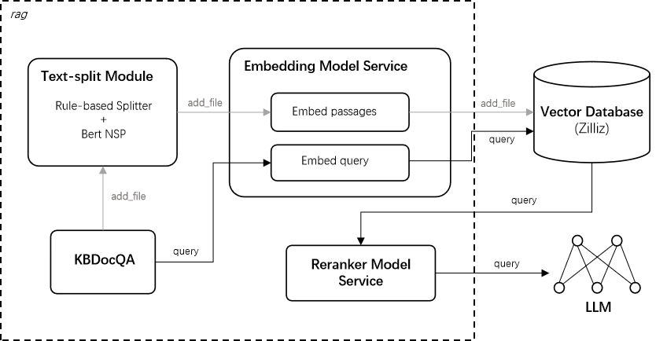

<div align="center">
  <h1>GeoGPT-RAG: Powering GeoGPT with Knowledge Retrieval</h1>
</div>

<div align="center" style="line-height: 1;">
 <a href="https://geogpt.zero2x.org/" target="_blank">
      
 </a>
 <a href="https://huggingface.co/GeoGPT-Research-Project" target="_blank">
      
 </a>
 <a href="https://modelscope.cn/profile/GeoGPT" target="_blank">
      
 </a>
 <br>
 <a href="https://www.linkedin.com/company/zhejianglab/posts/?feedView=all&viewAsMember=true" target="_blank">
        
 </a>
</div>

## 1. Introduction

GeoGPT-RAG is a Retrieval-Augmented Generation system designed to enhance the performance of [GeoGPT](https://github.com/GeoGPT-Research-Project/GeoGPT), an open large language model system designed for geoscience research. By retrieving information from a domain-specific corpus, GeoGPT-RAG ensures that generated responses are grounded in authoritative geoscientific literature and aligned with the context of user queries.

In addition to leveraging curated academic sources, GeoGPT-RAG allows users to upload custom datasets and build personalized knowledge bases, enabling localized retrieval from user-defined content. This is an essential feature for domain experts working with specialized or proprietary data.

To further improve the retrieval precision and contextual relevance, the GeoGPT-RAG system integrates two key components, namely [GeoEmbedding](https://huggingface.co/GeoGPT-Research-Project/GeoEmbedding) model and [GeoReranker](https://huggingface.co/GeoGPT-Research-Project/GeoReranker) model.

The [GeoEmbedding](https://huggingface.co/GeoGPT-Research-Project/GeoEmbedding) model is a geoscience-specific text embedding model built upon a high-performance large language model and fine-tuned on both general-purpose and in-domain geoscientific datasets. It produces accurate, context-aware vector representations of geoscientific texts, forming the backbone of vector-based retrieval in the RAG pipeline.

The [GeoReranker](https://huggingface.co/GeoGPT-Research-Project/GeoReranker) model complements this process by re-evaluating and ranking retrieved results. Unlike the GeoEmbedding model, which focuses on vector similarity, the GeoReranker model takes a query and a candidate passage as input and directly estimates their semantic relevance. It outputs a relevance score——typically normalized to a [0, 1] range via a sigmoid function——enabling more precise document ranking based on contextual alignment.

Together, the GeoGPT-RAG system and its two core models are open-sourced, empowering the GeoGPT project to better support the global geoscience research community.

## 2. System Information

The RAG pipeline supports both batch processing of PDF documents and online retrieval workflows. As illustrated in the following Figure, the architecture is designed for scalability and efficiency across different usage scenarios.

<div align="center">
  
</div>
 

To enhance the performance of the RAG process, we focus on text segmentation, embedding model fine-tuning, and reranker model fine-tuning.


## 3. Model Downloads

We provide model downloads both on [HuggingFace](https://huggingface.co/GeoGPT-Research-Project) and [Model Scope](https://modelscope.cn/profile/GeoGPT) . 

<div align="center">

| **Model** | **Params** |**Supported Language**| **Base Model** | **Hugging Face** |**ModelScope** |
| :-------: | :--------: | :------------------: |:-------------: | :--------------: | :-----------: | 
| GeoEmbedding | 7B | English | [Mistral-7B-Instruct-v0.1](https://huggingface.co/mistralai/Mistral-7B-Instruct-v0.1) | [🤗 Hugging Face](https://huggingface.co/GeoGPT-Research-Project/GeoEmbedding) | [🤖 ModelScope](https://modelscope.cn/models/GeoGPT/GeoEmbedding) |
| GeoReranker | 568M | Multilingual | [BGE-M3](https://huggingface.co/BAAI/bge-m3) | [🤗 Hugging Face](https://huggingface.co/GeoGPT-Research-Project/GeoReranker) | [🤖 ModelScope](https://modelscope.cn/models/GeoGPT/GeoReranker) | 
</div>

## 4. Quickstart

### Prerequisite

To use the RAG system, please prepare the [GeoEmbedding](https://huggingface.co/GeoGPT-Research-Project/GeoEmbedding) model & [GeoReranker](https://huggingface.co/GeoGPT-Research-Project/GeoReranker) model in advance.

- Embedding service
```shell
cd Embedding
pip install -r requirements.txt
python embedding_api.py --model_path %local Embedding model path% --port %any port%
```
- Reranker service
```shell
cd reranking
pip install -r requirements.txt
python reranker_fast_api.py --model_path %local Reranker model path% --port %any port%
```

### GeoEmbedding model
To load the GeoEmbedding model with Transformer, use the following snippet:
```python
import numpy as np
from sentence_transformers import SentenceTransformer

task_description = 'Given a web search query, retrieve relevant passages that answer the query'
def get_detailed_instruct(task_description: str, query: str) -> str:
    return f'Instruct: {task_description}\nQuery: {query}'

model_name_or_path = 'GeoGPT/GeoEmbedding'

model = SentenceTransformer(model_name_or_path, device="cuda", trust_remote_code=True)

queries = [
    "What is the main cause of earthquakes?",
    "How do sedimentary rocks form?",
]

passages = [
    "Earthquakes occur due to the sudden release of energy in the Earth's crust, often caused by tectonic plate movements along fault lines.",
    "Sedimentary rocks form through the deposition and compaction of mineral and organic particles over time, typically in water bodies.",
]

queries = [get_detailed_instruct(task_description, query) for query in queries]

q_vecs = model.encode(queries, normalize_embeddings=True)
p_vecs = model.encode(passages, normalize_embeddings=True)

print(np.dot(q_vecs, p_vecs.T)) 
#[[0.6369  0.2092 ]
# [0.2499  0.8411 ]]
```

### GeoReranker model
To load the GeoReranker model with Transformer, use the following snippet:

```python
from FlagEmbedding import FlagReranker
model_name_or_path = 'GeoGPT-Research-Project/Bge-M3-GeoReranker'
# Setting use_fp16 to True speeds up computation with a slight performance degradation
reranker = FlagReranker(model_name_or_path, use_fp16=True) 

score = reranker.compute_score(['query', 'passage'])
print(score)

# You can map the scores into 0-1 by set "normalize=True", which will apply sigmoid function to the score
score = reranker.compute_score(['query', 'passage'], normalize=True)
print(score)

scores = reranker.compute_score([['what is panda?', 'hi'], ['what is panda?', 'The giant panda (Ailuropoda melanoleuca), sometimes called a panda bear or simply panda, is a bear species endemic to China.']])
print(scores)
# You can map the scores into 0-1 by set "normalize=True", which will apply sigmoid function to the score
scores = reranker.compute_score([['what is panda?', 'hi'], ['what is panda?', 'The giant panda (Ailuropoda melanoleuca), sometimes called a panda bear or simply panda, is a bear species endemic to China.']], normalize=True)
print(scores)
```

### RAG Server
- Environment preparation
```shell
cd rag_server
pip install -r requirements.txt
```
- RAG server initialization (make sure that `zilliz` config is ready in `config.py`)
```python
from rag_server.geo_kb import KBDocQA

kb_server = KBDocQA()
```
- Upload `.mmd file`
```python
kb_server.add_file("xxx.mmd", max_size=512)
```
- Retrieval
```python
docs = kb_server.retrieval(query, k=top_k, expand_len=1000, score_threshold=0.0)
```
- RAG (LLM generation with retrieval)
```python
docs, ans = kb_server.query(query, k=top_k, expand_len=1000, score_threshold=0.0)
```
- Clear the collection (vector database)
```python
kb_server.drop_collection()
```

## 5. License and Uses
**License**:  This code repository is licensed under the [Apache License 2.0](https://github.com/GeoGPT-Research-Project/GeoGPT-RAG/blob/master/Apache_LICENSE), while the following models are licensed differently:

- GeoEmbedding: Licensed under the [Apache License 2.0](https://github.com/GeoGPT-Research-Project/GeoGPT-RAG/blob/master/Apache_LICENSE).
- GeoReranker: Licensed under the [MIT License](https://github.com/GeoGPT-Research-Project/GeoGPT-RAG/blob/master/MIT_LICENSE).

Please note the following dependencies:
- GeoEmbedding is trained on the foundation of [Mistral-7B-Instruct-v0.1](https://huggingface.co/mistralai/Mistral-7B-Instruct-v0.1), which is also licensed under the [Apache License 2.0](https://huggingface.co/datasets/choosealicense/licenses/blob/main/markdown/apache-2.0.md). It is your responsibility to ensure that your use of GeoEmbedding adheres to the terms of both the GeoEmbedding model and its upstream dependency, [Mistral-7B-Instruct-v0.1](https://huggingface.co/mistralai/Mistral-7B-Instruct-v0.1).

- GeoReranker is trained on the foundation of [BGE-M3](https://huggingface.co/BAAI/bge-m3), which is also licensed under the [MIT License](https://github.com/FlagOpen/FlagEmbedding/blob/master/LICENSE). It is your responsibility to ensure that your use of GeoReranker adheres to the terms of both the GeoReranker model and its upstream dependency, [BGE-M3](https://huggingface.co/BAAI/bge-m3).

**Primary intended use**：The primary use of this repo is to support geoscience research, providing geoscientists with innovative tools and capabilities enhanced by large language models. It is specifically designed for non-commercial research and educational purposes.

**Out-of-scope use**：The model is not intended for use in any manner that violates applicable laws or regulations, nor for any activities prohibited by the license agreement. Additionally, it should not be used in languages other than those explicitly supported, as outlined in this model card.


## 6. Contact
If you have any questions, please raise an issue or contact us at [support.geogpt@zhejianglab.org](support.geogpt@zhejianglab.org).
